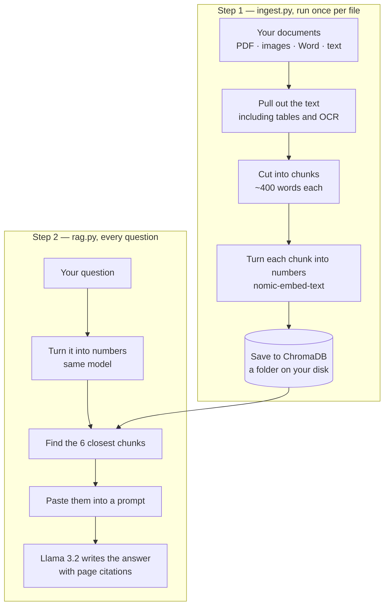

# Local RAG Chatbot

Ask questions about your own documents. Everything runs on your computer — no API keys, no accounts, nothing sent to the internet.

Drop PDFs, images, or Word files into a folder, run two commands, and start asking questions. Answers come back with the file name and page number they came from.

---

## What problem this solves

An AI model knows what it was trained on. It doesn't know what's in your PDFs.

You could paste a document into a chat window, but that stops working on a 200-page manual. This finds the relevant few paragraphs first and only sends those.

That approach is called RAG — retrieval-augmented generation. Retrieve the right text, then generate an answer from it.

---

## How it works



**In plain words:**

Your documents get chopped into small pieces. Each piece is converted into a list of numbers that represents its meaning — similar text gets similar numbers. Those go in a database on your disk.

When you ask something, your question gets converted the same way, and the database finds the pieces whose numbers are closest. Those pieces get pasted into a prompt, and a local model reads them and writes an answer.

The model never searches anything. It just receives a question with the relevant text already attached.

---

## What it can read

| You put in | What happens |
|---|---|
| PDF with text | Text and tables extracted directly |
| PDF with figures | Tesseract reads text inside the images |
| PDF page that's pure image | A vision model describes it |
| `.jpg`, `.png`, other images | OCR first, then a description |
| `.docx` | Paragraphs and tables |
| `.txt`, `.md`, `.csv` | Read as-is |

Tables get flattened into sentences like `Model: CAM-CIC-5000, Resolution: 5MP` — because the search works on words, not columns.

---

## Setup

You need a Mac or Linux machine, Python 3.9+, and about 5 GB of disk space.

**1. Install the tools**

```bash
brew install ollama tesseract poppler
```

**2. Download the models**

```bash
ollama pull nomic-embed-text   # turns text into numbers  (274 MB)
ollama pull llama3.2:3b        # writes the answers       (2 GB)
ollama pull moondream          # describes images         (1.7 GB)
```

**3. Get the code**

```bash
git clone https://github.com/Engineered0/local-rag-chatbot.git
cd local-rag-chatbot
python3 -m venv venv
source venv/bin/activate
pip install -r requirements.txt
```

---

## Using it

Open a terminal and start Ollama. Leave this one running:

```bash
ollama serve
```

In a second terminal, put some documents in `docs/`, then:

```bash
python ingest.py    # reads your files — takes a minute
python rag.py       # ask questions
```

Type `quit` to exit.

**Two extra commands inside `rag.py`:**

```
/files                        list your documents
@manual.pdf what is the FOV   search one file only
```

**Adding more documents later:** drop them in `docs/` and run `python ingest.py` again. Files it has already read are skipped, so only the new ones get processed.

---

## Reading the output

Before each answer, it prints the chunks it found:

```
--- retrieved ---
[manual.pdf p12 table] dist=0.31
Model: CAM-CIC-5000, Resolution: 5MP ...
```

- **p12** — the page it came from
- **table** — how the text was extracted (`text`, `table`, `ocr`, `vision`)
- **dist** — how close the match was. Lower is better. Above 1.0 usually means nothing relevant was found.

This printout is the most useful part of the whole tool. If the answer is wrong, look here first:

**The right chunk isn't listed** → the search failed. Try wording the question with terms that appear in the document, or raise `N_RESULTS` in `config.py`.

**The right chunk is listed but the answer is wrong** → the model failed. Tighten the prompt in `rag.py`, or use a bigger chat model.

Those are two completely different fixes, and you can't tell them apart without looking.

---

## The files

```
config.py      model names and settings — change things here
embedder.py    turns text into numbers
describe.py    OCR and image descriptions
ingest.py      reads your documents into the database
rag.py         asks questions
docs/          put your documents here
chroma_db/     the database (created automatically)
```

**Changing models.** All model names live in `config.py`.

Swapping the chat model (`CHAT_MODEL`) is free — edit the line and run.

Swapping the embedding model (`EMBED_MODEL`) means the saved numbers no longer match, so you have to rebuild:

```bash
rm -rf chroma_db .ingest_cache.json
python ingest.py
```

---

## Things to know before trusting it

**Answers are only as current as your documents.** This once returned a working OpenCV code snippet containing a deprecated function — because the PDF was from 2019. It wasn't making anything up. The source was just old.

**Image descriptions are for finding things, not for facts.** The vision model writes fluent descriptions and sometimes adds details that aren't in the picture. Good enough to make an image searchable. Not good enough to rely on.

**Schematics don't work, and that's deliberate.** Pinout drawings and wiring diagrams depend on which line touches which pin, and small vision models get that wrong while sounding confident. Rather than guess, the tool tells you which page to open. For anything you're going to physically wire, that's the right answer.

**Similar documents can get confused.** With several datasheets loaded, "what's the resolution" matches all of them. Name the model in your question, or use `@filename`.

---

## Ideas for later

- **Reranking** — fetch 15 chunks, score them more carefully, keep the best 4. Probably the biggest remaining improvement.
- **Keyword search alongside the vector search** — helps with exact strings like part numbers, where meaning-based search is weak.
- **A web interface** with Streamlit, instead of the terminal.
- **A set of test questions** with known answers, so changes can be measured instead of guessed at.

---

## Why there's no LangChain

LangChain would have saved maybe 40 lines. The cost is a large dependency tree and abstractions sitting between you and the thing going wrong.

Writing it directly meant that when retrieval returned nonsense, the fix was one print statement away. For a project whose point was understanding how RAG works, that was the whole value.
