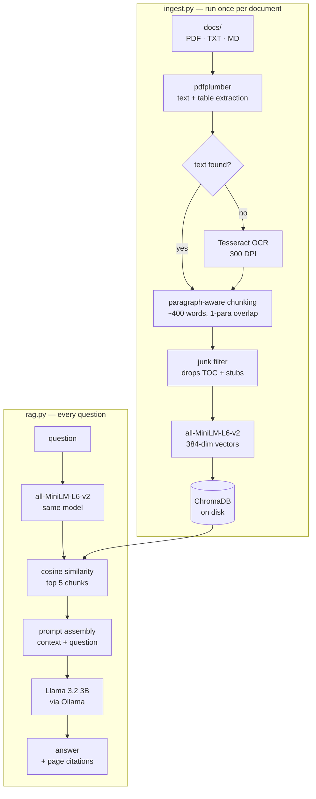

# Local RAG Chatbot

Ask questions about your own PDFs. Everything runs on your machine — no API keys, no cloud, no data leaving the laptop.

Built without LangChain, deliberately. The whole pipeline is about 120 lines of plain Python, which means every failure is debuggable in one print statement.

---

## Pipeline



The two halves share one thing: the embedding model. It must be identical on both sides, or the vectors aren't comparable and search returns confident nonsense.

---

## Stack

| Layer | Tool | Runs |
|---|---|---|
| PDF extraction | pdfplumber | local |
| OCR fallback | Tesseract | local |
| Embeddings | sentence-transformers (MiniLM) | local |
| Vector store | ChromaDB | local, persisted to disk |
| Generation | Ollama + Llama 3.2 3B | local |

---

## Setup

Requires Python 3.9+ and [Ollama](https://ollama.com).

```bash
brew install ollama tesseract poppler
ollama pull llama3.2:3b

git clone <your-repo-url> && cd ragbot
python3 -m venv venv && source venv/bin/activate
pip install -r requirements.txt
```

---

## Usage

Start Ollama in its own terminal:

```bash
ollama serve
```

Drop documents into `docs/`, then:

```bash
python ingest.py     # chunk, embed, store
python rag.py        # ask questions
```

`ingest.py` uses `upsert`, so re-running it updates existing chunks instead of duplicating them.

---

## How it works

**Chunking.** Documents are split on paragraph boundaries rather than fixed word counts. Fixed-width splitting cuts code blocks and tables in half, and a chunk containing half a code example matches poorly and answers worse.

**Embeddings.** Each chunk becomes 384 numbers representing its meaning. Text about similar things lands in similar coordinates, so "how do plants make food" retrieves a paragraph about photosynthesis despite sharing no words with it. This is why keyword search isn't enough.

**Junk filtering.** Table-of-contents pages are dot-leader noise that matches every query weakly and crowds out real matches. Chunks that are mostly punctuation or under 20 words get dropped at ingest.

**Retrieval.** The question is embedded with the same model and compared against stored vectors by cosine similarity. The top 5 come back with their source file and page number.

**Generation.** Retrieved chunks are pasted into a prompt above the question. The model is instructed to answer only from that context and to say `Not in the documents.` otherwise. It never touches the database — it just receives a question with the answer already attached.

---

## Debugging

`rag.py` prints retrieved chunks and their distance scores before the answer. This narrows every failure to one of two causes:

- **Right chunk missing** → retrieval problem. Adjust chunk size, `n_results`, or the junk filter.
- **Right chunk present, answer wrong** → generation problem. Tighten the prompt or use a larger model.

Those need opposite fixes. Without the print, you're guessing.

Distance above ~1.0 means a weak match — usually a sign nothing relevant exists in the corpus.

---

## Limitations

Answers inherit the age of the source documents. Retrieval will faithfully return a deprecated API call if that's what the PDF says.

Diagram-only pages (schematics, connector drawings) can't be parsed into text. They're stored as pointers telling you which page to open manually rather than guessed at.

A 3B model follows the context-only instruction less reliably than a larger one. Swapping to `qwen2.5:7b` in `rag.py` improves this if you have the RAM.

Semantic search is weak on exact strings — part numbers, error codes, pin numbers. Hybrid keyword search would help and isn't implemented.

---

## Possible next steps

- Reranking: retrieve 15, score with a cross-encoder, keep the best 4
- Hybrid search (BM25 + vector) for exact-match terms
- A held-out question set to measure retrieval changes instead of eyeballing them
- Streamlit UI for uploads and chat
